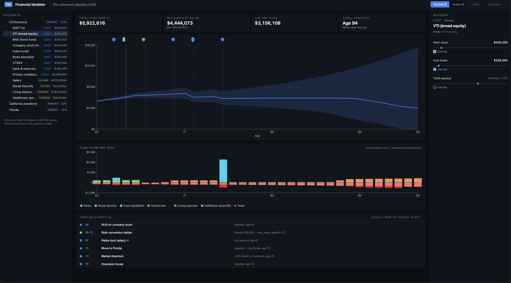
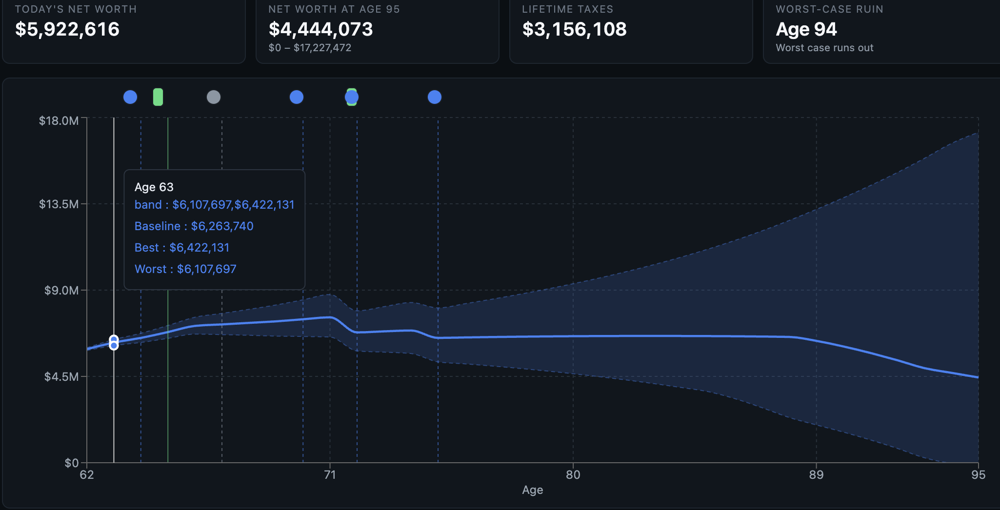
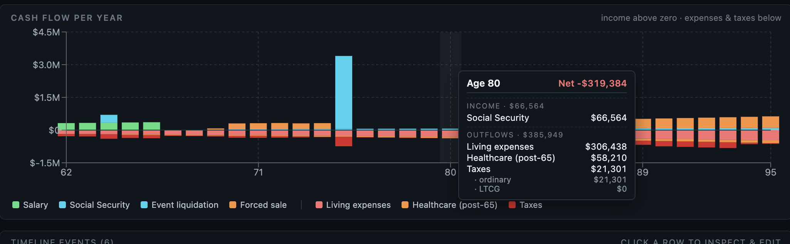
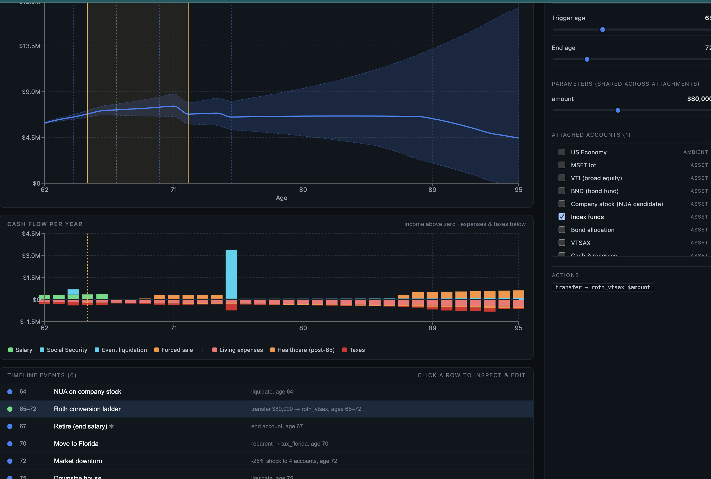

# Personal Finance Modeler — Design Notes (Post Mock #1)

This document supersedes the mock-era `PRD.md` and `DESIGN.md` for everything covered below. Read those for original framing; treat this doc as authoritative when they conflict. It is written so an implementer (human or agent) starting fresh can proceed without reading the development transcript.

---

## 1. Product in one paragraph

A local-first, deterministic, event-driven personal finance projection tool for someone who *can* retire but hasn't yet. The user's primary jobs are wealth preservation, tax planning, and inheritance planning — not long-term accumulation. They want to model decisions like "should I do a Roth conversion ladder?", "what does moving to Florida do to my taxes?", "when should I sell the house?", and see the cumulative effect on net worth and lifetime taxes through their planning horizon. Configuration *is* the model: a tree of accounts plus a list of timeline events; the engine projects forward, the UI is a visual editor.

## 2. Mental model

These are non-negotiable; everything else hangs off them.

- **Everything is an account.** Investment lots ("MSFT lot at Schwab"), liabilities, real assets, income streams (job, Social Security, pension), expense streams (living expenses, healthcare), and ambient/economic values (US Economy yields, inflation, tax jurisdictions) are all nodes in one tree.
- **Inheritance follows the tree.** A child node either declares a value explicitly or inherits from its nearest ancestor that has it. By-type inheritance: an equity-class asset reads `equity_yield` from the nearest ancestor that defines it (typically `US Economy`).
- **Events transform attached accounts.** A `TimelineEvent` is placed at an age (or age range) and attached to one or more accounts. When triggered, it mutates values on those accounts using parameters that are *shared across all attachments*. (To apply different parameters to different accounts, create separate events. There is no event hierarchy in V1.)
- **Sliders edit starting values, not globals.** What looked like environment globals (inflation 3%, equity 7%) are scalar fields on ambient nodes (e.g., `US Economy`). To make a value change over time, place an event.
- **Holdings are first-class.** Sub-account holdings have identity. NUA-style events target one specific holding inside a 401(k), not the whole account.
- **Custodian is a tag, not a tree level.** Schwab/Fidelity/Vanguard live as tags on individual accounts. They are *not* levels in the inheritance tree because two accounts at the same custodian can inherit from different ambients.
- **Scalar attributes belong in the inspector, not the tree.** A node with N scalar fields shows them in its inspector, not as N child nodes. Tree nodes are entities; scalar config lives inside.

## 3. Data schema

TypeScript-flavored. Adapt freely to other languages but keep the shape.

```ts
type AccountKind =
  | 'category'   // structural grouping; no balance of its own
  | 'ambient'    // an ambient/economic value (US Economy, jurisdiction)
  | 'asset'      // grows by yield; e.g., stock lot, cash, house
  | 'liability'  // debt; grows by interest_rate
  | 'income'     // produces cash into the cash sink
  | 'expense';   // consumes cash from the cash sink

type AssetClass = 'equity' | 'bond' | 'cash' | 'real_estate' | 'other';
type TaxTreatment = 'taxable' | 'tax_deferred' | 'tax_free';

// A field that may be inherited (undefined), explicit (number), or a
// modifier on the inherited value (delta).
type FieldValue =
  | undefined
  | number
  | { mode: 'absolute' | 'delta'; value: number };

interface AccountNode {
  id: string;
  name: string;
  kind: AccountKind;
  parent_id: string | null;

  // Tags & metadata (do NOT participate in inheritance).
  asset_class?: AssetClass;
  tax_treatment?: TaxTreatment;
  custodian?: string;

  // Per-asset-class yields, typically defined on ambient parents and
  // inherited via by-type lookup.
  equity_yield?: FieldValue;
  bond_yield?: FieldValue;
  cash_yield?: FieldValue;
  real_estate_yield?: FieldValue;
  inflation_rate?: FieldValue;

  // Resolvable values; inheritance walks parent chain.
  start_value?: number;        // current balance for assets
  yield_rate?: FieldValue;     // explicit override on a single asset
  cost_basis?: number;
  effective_tax_rate?: FieldValue;  // on jurisdiction nodes

  // Income / expense streams
  start_age?: number;
  end_age?: number;
  annual_amount?: number;
  growth_rate?: FieldValue;    // applied to annual_amount
}

type ActionType =
  | 'set_value'      // set a field on the attached account
  | 'add_value'      // add to a numeric field; |v|<1 treated as a fractional shock
  | 'transfer'       // move money to another account; if source is tax_deferred, tax as ordinary
  | 'liquidate'      // sell asset; deposit net proceeds into cash account; close the asset
  | 'reparent'       // change actor's active jurisdiction (or other parent)
  | 'end_account';   // mark inactive at this age

interface ActionTemplate {
  type: ActionType;
  field?: string;
  value?: number;
  param_ref?: string;       // name of a TimelineEvent parameter to read at runtime
  target_account?: string;  // for transfer / liquidate destination
  new_parent?: string;      // for reparent
}

interface TimelineEvent {
  id: string;
  name: string;
  description?: string;
  trigger_age: number;
  end_age?: number;            // present → ranged/recurring
  kind: 'one_shot' | 'recurring';
  attached_account_ids: string[];
  parameters: Record<string, number>;  // shared across attachments
  actions: ActionTemplate[];
  auto_generated?: boolean;    // synthesized from declarative state (e.g., end_age on a stream)
}

interface Actor {
  current_age: number;
  horizon_age: number;
  cash_account_id: string;          // the sink for income / expenses / withdrawals
  jurisdiction_account_id: string;  // currently-active jurisdiction node
  scenario_name: string;
}

interface YearlyProjection {
  age: number;
  year: number;

  total_baseline: number;
  total_best: number;
  total_worst: number;

  by_account: Record<string, number>;   // asset balances at end of year

  taxes_paid: number;
  tax_ordinary: number;
  tax_ltcg: number;

  cumulative_inflation_index: number;
  events_this_year: TimelineEvent[];

  income_received: number;
  expenses_paid: number;
  income_by_source: Record<string, number>;
  expense_by_source: Record<string, number>;
  event_liquidation_proceeds: number;
  forced_sale_proceeds: number;
}
```

### Schema decisions worth flagging

- **`end_account`** as a primitive (not a separate event kind) lets the user place explicit "stop this stream" events. We also auto-generate one when an `income`/`expense` stream has `end_age` set — the auto-generated version carries `auto_generated: true` so the UI can mark it (a `✱` glyph in the mock).
- **`add_value` semantics**: when `Math.abs(value) < 1`, treated as a fractional shock (`balance *= 1 + value`); otherwise a flat add. Keeps "−25 % market shock" and "−$50k one-time draw" expressible with one primitive.
- **Tax jurisdictions are siblings** under no parent (or under a `category` node like "Tax"). The actor references one via `jurisdiction_account_id`. A "move" event uses `reparent` to swap the actor's jurisdiction reference.
- **No event templates in V1.** A small library of common patterns (Roth ladder, move, sell asset, market shock, NUA) belongs in v2 of the event composer; for now the user wires events up by hand.

## 4. Engine contract

```ts
function project(
  accounts: AccountNode[],
  actor: Actor,
  events: TimelineEvent[],
): YearlyProjection[]
```

**Pure, deterministic, side-effect-free.** Same inputs → same outputs. The UI calls it on every state change; it must be cheap enough to re-run on every slider tick (a 33-year horizon × 3 scenarios × ~20 accounts is well under a millisecond — don't memoize prematurely, but don't add quadratic loops).

### Annual loop (per scenario)

For each scenario in `[baseline (+0), best (+volatility), worst (-volatility)]`:

For each year from `current_age` to `horizon_age`:

1. **Evolve inflation.** Multiply `inflation_index` by `(1 + inflation_rate)`. Inflation is read by walking the parent chain from any node (we use the cash account's chain).
2. **Apply triggered events.** Filter `events` by `eventFires(event, age)`. For each, iterate `attached_account_ids × actions`. Each action mutates one account; track tax (ordinary vs LTCG) and liquidation proceeds.
3. **Apply income & expense streams.** For each active income/expense account, compute `annual_amount × (1 + growth_rate)^(age - start_age)`. Income flows to the cash account net of ordinary tax; expense flows out gross. Income/expense growth is *nominal* — they already account for inflation via `growth_rate`; do NOT additionally multiply by `inflation_index`.
4. **Cover negative cash with forced sales.** If the cash account went negative this year, withdraw from assets in order: `taxable → tax_deferred → tax_free`. Tax-deferred withdrawals gross-up by `1 / (1 - tax_rate)` and pay ordinary tax. Taxable withdrawals pay LTCG on the gain portion. Track `forced_sale_proceeds` and the corresponding tax separately so the UI can show "you didn't plan for this gap."
5. **Grow assets.** For each active asset, `balance *= 1 + effectiveYield`, where `effectiveYield = inheritedTypedYield + (asset.yield_rate is delta ? delta : 0)` or the asset's explicit override. Apply the scenario shift (full to equity, ~0.4× to bonds, none to cash).
6. **Snapshot.** Record total portfolio value, by-account balances, tax breakdowns, income/expense breakdowns, and the inflation index.

### Cone math

Use **horizon-shock**, not annual independent volatility: best = baseline + vol, worst = baseline − vol, applied as a shift to each year's growth. Compounds smoothly over decades; legible for preservation users. Annual independent draws compound to absurdly wide cones over 30+ years and aren't what this user worries about.

### Tax model — known limitation

The mock used a single `effective_tax_rate` per jurisdiction. This is **wrong for the target user's primary jobs** (Roth conversions, capital-gains harvesting, NUA, IRMAA-cliff arbitrage). For real implementation:

- Federal and state tax tables, both bracket-based, both user-editable.
- Separate brackets for ordinary income vs LTCG/qualified dividends.
- IRMAA tiers.
- Locale move = swap the actor's jurisdiction reference.

Until brackets are in, **do not add** a `tax_deductible: bool` flag to expense accounts — it would double-count savings against an already-blended rate. Bundle deductibility with the bracket upgrade.

### Tax tracking — split required

Every tax accrual must be classified at the source as `ordinary` or `ltcg`. The breakdown is surfaced in the cash-flow tooltip; aggregating only a single `taxes_paid` total loses information the target user needs.

| Source                                     | Bucket              |
| ------------------------------------------ | ------------------- |
| Salary / SS / pension                      | ordinary            |
| Roth conversion                            | ordinary            |
| Tax-deferred liquidation: basis portion    | ordinary            |
| Tax-deferred liquidation: gain portion     | ltcg (proxy ~0.6×)  |
| Taxable liquidation: gain over exclusion   | ltcg                |
| Forced withdrawal from tax-deferred        | ordinary            |
| Forced withdrawal from taxable: gain part  | ltcg                |

(0.6× is the LTCG-as-proxy-of-ordinary multiplier; replace with real bracket math when upgrading.)

### Withdrawal sequencing

Two layers, both required:

- **Default policy** (engine-applied): when cash goes negative, withdraw `taxable → tax_deferred → tax_free`. This is the safety net.
- **Explicit liquidate events** (user-placed): proactively sell assets at chosen ages. Tax-aware users place these to control timing of gain realization (e.g., harvest losses, time conversions, etc.).

Visualize forced and explicit liquidations differently in the cash-flow chart. Forced sale = "you didn't plan for this." Event liquidation = "you chose this."

## 5. UX architecture

> **Note on screenshots in this section.** The four PNGs under `docs/images/` are reference snapshots from mock #1 — not pixel-perfect specs. Use them to anchor the *information architecture* and *interaction signals* (selection sync, draggable nodes, tooltip structure). A fresh implementation should re-derive the visual treatment from the principles in this doc.

### Layout (the hero screen)

```
┌──────────────────────────────────────────────────────────────────────┐
│  TopBar:  brand · scenario name · Nominal $/Today's $ · Save · Compare│
├──────────────┬───────────────────────────────────────┬─────────────────┤
│ AccountsTree │ SummaryStrip (4 KPIs)                  │  Inspector      │
│              │ NetWorthChart (cone + event lines)     │   (account OR   │
│  click =     │ CashFlowChart (stacked bars + tooltip) │    event,       │
│  inspect     │ EventTimeline (list, sorted by age)    │   based on     │
│              │                                        │    selection)  │
└──────────────┴───────────────────────────────────────┴─────────────────┘
```



*Hero shot. Left: AccountsTree with US Economy ambient + personal accounts + jurisdictions. Center top: SummaryStrip (4 KPIs), NetWorthChart with cone and event nodes above the plot, CashFlowChart with stacked bars + legend. Center bottom: EventTimeline list. Right: AccountInspector showing VTI lot — start value, cost basis, and an inherited equity yield with an Override checkbox. The "Today's $" toggle is in the topbar.*

### Key components

- **AccountsTree** — collapsible nested tree, ambient at top, click selects.
- **NetWorthChart** — single line + cone; **vertical lines per event** colored by kind; **draggable circle/square nodes above the plot** for direct retiming; **translucent ReferenceArea spanning ranged events when selected.**

  

  *NetWorthChart with the cone shaded around the baseline, hover tooltip showing baseline/best/worst at age 63, and the row of event nodes above the plot. Vertical dashed lines mark each event's trigger age; the gold/orange line is the selected event, blue lines are unselected. The dot color above each line encodes kind: blue = one-shot, green = recurring, gray = auto-generated.*

- **CashFlowChart** — stacked bars, income above zero, expenses & taxes below; **single "Taxes" segment in the bar** with the breakdown only in the tooltip.

  

  *CashFlowChart at age 80 — Net cash flow at the **top** of the tooltip in red (−$319k), color-coded for sign. Income section lists each source individually (Social Security $66k); Outflows section lists each expense source plus a Taxes line with `· ordinary` and `· LTCG` subrows. The big cyan bar at age 75 is the house-sale event liquidation. Putting Net at the top is intentional: even when the tooltip is clipped at the bottom by the parent's overflow, the most important number survives.*

- **EventTimeline (list-only)** — vertical rows, sorted by `trigger_age`, click to select. **No inline expansion**; selected event opens in the right Inspector.
- **Inspector** — context-switches between `AccountInspector` and `EventInspector` based on selection. Both share the same surface for visual consistency.

  

  *Roth conversion ladder selected. The Inspector (right) shows the ranged-event editor: trigger_age and end_age sliders, a `parameters` section with the shared `amount` slider ($80k), an attached-accounts checklist (only `Index funds` checked), and the Actions list rendered as a `transfer → roth_vtsax $amount` chip. Selection sync: the same event is highlighted in the EventTimeline list (bottom, gold row "65–72 Roth conversion ladder"), the chart's vertical lines at ages 65 and 72 are gold, and the gold ReferenceArea spans the range across both charts.*

### Hard rules (lessons learned the painful way)

1. **One Inspector for both accounts and events.** Lists/trees/timelines select; the Inspector edits. No parallel inline editors. This is non-negotiable.
2. **Drag affordance must not move under the pointer.** Don't put a slider in a list whose order depends on the slider value. Drag handles for retiming live on the chart, not in the list.
3. **Scalar attributes go in the inspector, not as tree children.** Don't expose "equity_yield 7 %" as a child of US Economy; show it inside US Economy's inspector.
4. **Custodian is a tag, not a tree level.** Don't model Schwab as a parent of MSFT.
5. **Round ages at every state-write boundary.** Drag math produces fractional ages; `setEventAge` must `Math.round()` both `trigger_age` and `end_age`. Without this, `eventFires(event, age)` (which compares to integer ages) silently fails to fire.
6. **Drag clamping must cover both bounds.** The "whole event" drag handle especially — if you only clamp the lower bound, users drag events past horizon_age and they never fire.
7. **Summary in chart, detail in tooltip.** For long-horizon dense charts, multiple thin segments are noise. Coarse top-level segments + a custom `<Tooltip content={…}>` with structured sections is the right idiom.
8. **Custom tooltips on charts inside scroll containers get clipped.** Use `allowEscapeViewBox={{ y: true }}` and put the most important number (Net cash flow) at the **top** of the tooltip so it survives clipping.
9. **Auto-events should be visually marked.** When the engine synthesizes an event from a declarative field (e.g., `salary.end_age`), display a `✱` glyph and label it auto-generated in the inspector. The user must be able to see the model's interpretation of their input.

### Component patterns that *did not work* — do not retry

- **Sliders inside reordering event lists** (v1). Row jumps under the cursor mid-drag.
- **A pin strip of event chips above the chart** (v2). Too cramped, especially when events cluster.
- **Inline expand-to-edit in the event list** (v3, v4). Inconsistent with the account-edit pattern.
- **Gantt-mode in the event timeline** (v4). Reproduced the chart story without adding signal; the user scrapped it.
- **A connecting bar above the chart between range-event endpoints** (v3). Visually noisy. Two thin vertical lines + a translucent in-chart `ReferenceArea` on selection is enough.

### Selection model

```ts
type Selection =
  | { kind: 'none' }
  | { kind: 'account'; id: string }
  | { kind: 'event'; id: string };
```

A single selection variable consumed by Inspector + chart (highlight) + lists (row state). Hover state is separate (`hoveredEventId: string | null`). Selection AND hover both promote the visual treatment of the corresponding chart vertical line / ReferenceArea / list row.

## 6. Real-vs-Nominal toggle

The engine produces only nominal dollars and a `cumulative_inflation_index`. The UI toggles divide all dollar values by the index when in "Today's $" mode. Income/expense streams already grow at their own `growth_rate` in nominal — *do not also multiply by `inflation_index`* in the engine, or growth will compound twice when the toggle flips.

## 7. Out of scope for V1 (and notes for when to add)

| Feature                                  | Notes for later                                                |
| ---------------------------------------- | -------------------------------------------------------------- |
| Bracket-based federal + state taxes      | Highest-leverage upgrade for the target user. Bundle with IRMAA and `tax_deductible` expense flag. |
| RMDs                                     | Either an auto-event from a tax-deferred account when `current_age >= 73`, or a per-account flag. |
| Step-up basis at death                   | Trivial primitive (`set cost_basis = balance` on taxable assets at horizon age). UI is the deferred part. |
| Couples / joint MFJ with two ages        | V1 treats the household as a single MFJ filer. Add a second `Actor` and split SS/RMD per spouse.  |
| Scenario compare (overlay A vs B)        | Storage of multiple scenarios + chart overlay. The killer demo for tax-planning trade-offs.       |
| Event templates / template gallery       | Curated library: Roth ladder, move, sell asset, market shock, NUA, salary change. Custom escape hatch. |
| Persistence                              | `localStorage` of the Zustand store, JSON export/import. Not built in mock.                      |
| Chart zoom (Brush)                       | Started but punted because draggable nodes don't follow brushed domain cleanly. Solve before adding. |
| Tax-deductible expense distinction       | Defer until brackets — would double-count under blended-rate model.                              |
| Holding-level cost basis lots            | We track one basis per asset; real users have multiple lots per holding (FIFO / specific-ID).    |

## 8. Implementation gotchas

- **Round ages at the state-write boundary.** As above. Without this, drag produces silently-non-firing events.
- **Drag clamping must cover both bounds and ranged-event spans.** Maintain `end - start` constant when dragging the "whole" handle of a ranged event.
- **`useEffect` deps for the drag listener change every render** because `xToAge` is recomputed. Either stabilize via `useCallback` or capture via ref. The naive version works but re-attaches listeners on every render.
- **Recharts tooltips inside `overflow-y: auto` parents get clipped.** Use `allowEscapeViewBox`, `wrapperStyle: { zIndex: 100 }`, and put the most important info at the top of the tooltip body so it survives clipping.
- **Engine produces three scenarios from one config.** Run the loop three times with different shifts. Don't try to derive best/worst by post-hoc multiplication of baseline — events that fire on absolute balances need to fire in each scenario's own simulation.
- **`event.attached_account_ids` may be empty** (e.g., `reparent` events that act on the actor, not an account). The action loop must handle the empty-attachments case (iterate once with a synthetic empty id).
- **Ambient inflation read.** We resolve `inflation_rate` by walking up from the cash account. Any account in the personal subtree works as an anchor; pick a stable one.
- **`Math.abs(v) < 1` heuristic** for `add_value` works in practice but is a footgun if anyone ever passes 0.5 meaning "$0.50". For V1 it's fine because dollars are integers in this domain. Document it; don't extend it.

## 9. Open questions worth flagging

- **Override expression syntax.** The mock uses `{ mode: 'absolute' | 'delta', value: number }`. A future text syntax like `parent.yield + 2%` would be more expressive but needs a parser. The structured representation is sufficient for the UI we want; defer expressions until templates demand them.
- **Auto-event generation from declarative fields.** The pattern is validated (e.g., `salary.end_age` should auto-create an `end_account` event marked `auto_generated`). Implementation question: do these get *materialized* into the events array on save, or *derived* on every projection? Deriving keeps the source of truth on the account; materializing makes the timeline self-explanatory but creates two places to edit.
- **Templates vs custom events.** When the event composer ships, the bias should be a small curated template library + a "Custom" escape hatch, *not* a fully generic builder. The validation goal is "can the user model their own situation", not "can the user invent novel event semantics."

## 10. Tech stack used in the mock

Vite + React + TypeScript + Zustand + Recharts. Plain CSS in one file. Node 20.20.2 (the create-vite scaffold requires ≥ 20.19). No persistence layer. No router (single page). No tests (yet — engine purity makes it cheap to add: feed seed data, snapshot the projection).

## 11. What mock #1 validated

- The unified-ledger mental model is right: one user can build a realistic household setup (US Economy ambient + ~12 personal accounts + ~6 events) and read meaningful results out of it.
- Real-time slider feedback feels good even with a re-run-the-engine-on-every-change strategy.
- Inheritance via the tree + per-asset overrides is sufficient for the target user's mental model.
- The cash-flow bar chart with a structured tooltip is the breakthrough: tax impact and forced sales are visible *only* with this view; without it the tool can't actually answer the user's questions.
- Three-pane layout with a single Inspector is the right shape.

## 12. What mock #1 did not validate

- Creation flows (add account, add event from scratch). Mock #2's job.
- Scenario compare. Mock #3's job (probably — and the PM thinks it's "pretty straightforward" given the engine is pure, just run it twice with different events).
- Persistence and JSON import/export.
- Real bracket-based taxes and IRMAA.
- Couples, RMDs.

A fresh implementation should build #1's surface first (the schema and engine are settled), then layer creation flows and compare on top.
